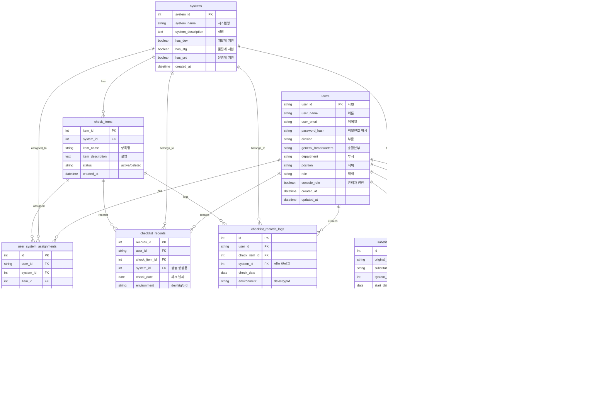

# 데이터베이스 스키마 문서

## 목차
1. [ER 다이어그램](#er-다이어그램)
2. [테이블 설명](#테이블-설명)
3. [컬럼 상세 설명](#컬럼-상세-설명)
4. [외래키 관계](#외래키-관계)
5. [제약조건](#제약조건)

---

## ER 다이어그램

---

## 테이블 설명

### 1. `users` - 사용자 테이블
시스템 사용자 정보를 저장하는 테이블입니다. 사번(`user_id`)을 기본키로 사용하며, 조직 정보와 권한 정보를 포함합니다.

**주요 특징:**
- 사번을 기본키로 사용 (문자열)
- 조직 계층 구조 정보 저장 (부문, 총괄본부, 부서)
- 관리자 권한(`console_role`) 관리

---

### 2. `systems` - 시스템 테이블
체크리스트를 관리할 시스템 정보를 저장하는 테이블입니다.

**주요 특징:**
- 각 시스템이 지원하는 환경 정보 저장 (`has_dev`, `has_stg`, `has_prd`)
- 시스템별로 지원하는 환경이 다를 수 있음

---

### 3. `check_items` - 체크 항목 테이블
각 시스템에 대한 체크리스트 항목을 정의하는 테이블입니다.

**주요 특징:**
- 환경과 무관하게 항목 정의만 저장 (환경별 구분 없음)
- Soft Delete 지원 (`status`: 'active' 또는 'deleted')
- 같은 시스템 내에서 항목명은 유일해야 함

---

### 4. `user_system_assignments` - 담당자 배정 테이블
사용자를 특정 시스템의 특정 항목에 환경별로 배정하는 테이블입니다.

**주요 특징:**
- 환경별로 담당자 배정 가능 (dev, stg, prd)
- 같은 사용자가 같은 항목의 여러 환경에 배정될 수 있음
- (user_id, system_id, item_id, environment) 조합은 유일해야 함

---

### 5. `checklist_records` - 체크리스트 기록 테이블
실제 체크리스트 점검 결과를 저장하는 테이블입니다.

**주요 특징:**
- 환경별로 점검 결과 저장
- 같은 항목의 같은 날짜, 같은 환경에 대해 하나의 기록만 존재 (Unique Constraint)
- `system_id`는 성능 향상을 위해 비정규화(denormalized)되어 저장됨
- PASS/FAIL 상태와 실패 시 사유 저장

---

### 6. `checklist_records_logs` - 체크리스트 기록 로그 테이블
체크리스트 기록의 모든 변경 이력을 저장하는 테이블입니다.

**주요 특징:**
- CREATE, UPDATE, DELETE 모든 액션 기록
- 변경 이력 추적을 위한 감사(audit) 목적
- `system_id`는 성능 향상을 위해 비정규화되어 저장됨

---

### 7. `substitute_assignments` - 대체 담당자 할당 테이블
일시적으로 담당자를 대체하는 정보를 저장하는 테이블입니다.

**주요 특징:**
- 시스템 단위로 대체 담당자 지정
- 시작일과 종료일로 기간 관리
- 원래 담당자와 대체 담당자 모두 저장

---

### 8. `substitute_assignments_logs` - 대체 담당자 할당 로그 테이블
대체 담당자 할당의 모든 변경 이력을 저장하는 테이블입니다.

**주요 특징:**
- CREATE, UPDATE, DELETE 모든 액션 기록
- 변경 전/후 데이터를 JSON 형식으로 저장
- 삭제된 할당의 경우 `substitute_assignment_id`는 NULL이 될 수 있음

---

### 9. `admin_logs` - 관리자 작업 로그 테이블
관리자가 수행한 시스템/항목/담당자 관리 작업을 기록하는 테이블입니다.

**주요 특징:**
- 시스템, 체크 항목, 담당자 배정 관리 작업 기록
- `entity_type`에 따라 다른 엔티티 타입의 작업 기록
- `environment`는 assignment 등 환경별 구분이 필요한 경우에만 저장 (check_item은 NULL)

---

## 컬럼 상세 설명

### `users` 테이블

| 컬럼명 | 타입 | 제약조건 | 설명 |
|--------|------|----------|------|
| `user_id` | VARCHAR(50) | PK, NOT NULL | 사번 (기본키) |
| `user_name` | VARCHAR(100) | NOT NULL | 사용자 이름 |
| `user_email` | VARCHAR(255) | NOT NULL | 이메일 주소 |
| `password_hash` | VARCHAR(255) | NOT NULL | 비밀번호 해시값 |
| `division` | VARCHAR(100) | NULL | 부문 (본부장만 존재) |
| `general_headquarters` | VARCHAR(100) | NULL | 총괄본부 (팀장 이상 존재) |
| `department` | VARCHAR(100) | NULL | 부서 (파트장/팀원만 존재) |
| `position` | VARCHAR(50) | NULL | 직위 |
| `role` | VARCHAR(50) | NULL | 직책 |
| `console_role` | BOOLEAN | NOT NULL, DEFAULT FALSE | 콘솔 페이지 접근 권한 (관리자) |
| `created_at` | DATETIME | NOT NULL, DEFAULT NOW() | 생성 일시 |
| `updated_at` | DATETIME | NOT NULL, DEFAULT NOW() | 수정 일시 |

---

### `systems` 테이블

| 컬럼명 | 타입 | 제약조건 | 설명 |
|--------|------|----------|------|
| `system_id` | INTEGER | PK, NOT NULL | 시스템 ID (기본키) |
| `system_name` | VARCHAR(100) | NOT NULL | 시스템명 |
| `system_description` | TEXT | NULL | 시스템 설명 |
| `has_dev` | BOOLEAN | NOT NULL, DEFAULT FALSE | 개발계 환경 지원 여부 |
| `has_stg` | BOOLEAN | NOT NULL, DEFAULT FALSE | 품질계 환경 지원 여부 |
| `has_prd` | BOOLEAN | NOT NULL, DEFAULT FALSE | 운영계 환경 지원 여부 |
| `created_at` | DATETIME | NOT NULL, DEFAULT NOW() | 생성 일시 |

---

### `check_items` 테이블

| 컬럼명 | 타입 | 제약조건 | 설명 |
|--------|------|----------|------|
| `item_id` | INTEGER | PK, NOT NULL | 항목 ID (기본키) |
| `system_id` | INTEGER | FK → systems.system_id, NOT NULL | 시스템 ID (외래키, CASCADE DELETE) |
| `item_name` | VARCHAR(200) | NOT NULL | 항목명 |
| `item_description` | TEXT | NULL | 항목 설명 |
| `status` | VARCHAR(20) | NOT NULL, DEFAULT 'active' | 상태 ('active' 또는 'deleted', Soft Delete) |
| `created_at` | DATETIME | NOT NULL, DEFAULT NOW() | 생성 일시 |

**Unique Constraint:**
- `(system_id, item_name)`: 같은 시스템 내에서 항목명은 유일해야 함

**Check Constraint:**
- `status IN ('active', 'deleted')`: 상태는 'active' 또는 'deleted'만 가능

---

### `user_system_assignments` 테이블

| 컬럼명 | 타입 | 제약조건 | 설명 |
|--------|------|----------|------|
| `id` (DB: `assign_id`) | INTEGER | PK, NOT NULL | 배정 ID (기본키) |
| `user_id` | VARCHAR(50) | FK → users.user_id, NOT NULL | 사용자 ID (외래키, CASCADE DELETE) |
| `system_id` | INTEGER | FK → systems.system_id, NOT NULL | 시스템 ID (외래키, CASCADE DELETE) |
| `item_id` | INTEGER | FK → check_items.item_id, NOT NULL | 체크 항목 ID (외래키, CASCADE DELETE) |
| `environment` | VARCHAR(10) | NOT NULL, DEFAULT 'prd' | 환경 ('dev', 'stg', 'prd') |
| `created_at` | DATETIME | NOT NULL, DEFAULT NOW() | 생성 일시 |

**Unique Constraint:**
- `(user_id, system_id, item_id, environment)`: 같은 사용자가 같은 항목의 같은 환경에 중복 배정될 수 없음

**Check Constraint:**
- `environment IN ('dev', 'stg', 'prd')`: 환경은 'dev', 'stg', 'prd' 중 하나여야 함

---

### `checklist_records` 테이블

| 컬럼명 | 타입 | 제약조건 | 설명 |
|--------|------|----------|------|
| `records_id` | INTEGER | PK, NOT NULL | 기록 ID (기본키) |
| `user_id` | VARCHAR(50) | FK → users.user_id, NOT NULL | 체크한 사용자 ID (외래키, CASCADE DELETE) |
| `check_item_id` (DB: `item_id`) | INTEGER | FK → check_items.item_id, NOT NULL | 체크 항목 ID (외래키, CASCADE DELETE) |
| `system_id` | INTEGER | FK → systems.system_id, NULL | 시스템 ID (외래키, CASCADE DELETE, 성능 향상용 비정규화) |
| `check_date` | DATE | NOT NULL | 체크 날짜 |
| `environment` | VARCHAR(10) | NOT NULL, DEFAULT 'prd' | 환경 ('dev', 'stg', 'prd') |
| `status` | VARCHAR(10) | NOT NULL | 상태 ('PASS' 또는 'FAIL') |
| `fail_notes` | TEXT | NULL | 실패 사유 (FAIL인 경우) |
| `checked_at` | DATETIME | NOT NULL, DEFAULT NOW() | 체크 일시 |

**Unique Constraint:**
- `(item_id, check_date, environment)`: 같은 항목의 같은 날짜, 같은 환경에 대해 하나의 기록만 존재

**Check Constraint:**
- `status IN ('PASS', 'FAIL')`: 상태는 'PASS' 또는 'FAIL'만 가능
- `environment IN ('dev', 'stg', 'prd')`: 환경은 'dev', 'stg', 'prd' 중 하나여야 함

---

### `checklist_records_logs` 테이블

| 컬럼명 | 타입 | 제약조건 | 설명 |
|--------|------|----------|------|
| `id` | INTEGER | PK, NOT NULL | 로그 ID (기본키) |
| `user_id` | VARCHAR(50) | FK → users.user_id, NOT NULL | 작업한 사용자 ID (외래키, CASCADE DELETE) |
| `check_item_id` | INTEGER | FK → check_items.item_id, NOT NULL | 체크 항목 ID (외래키, CASCADE DELETE) |
| `system_id` | INTEGER | FK → systems.system_id, NULL | 시스템 ID (외래키, CASCADE DELETE, 성능 향상용 비정규화) |
| `check_date` | DATE | NOT NULL | 체크 날짜 |
| `environment` | VARCHAR(10) | NOT NULL, DEFAULT 'prd' | 환경 ('dev', 'stg', 'prd') |
| `status` | VARCHAR(10) | NOT NULL | 상태 ('PASS' 또는 'FAIL') |
| `fail_notes` | TEXT | NULL | 실패 사유 |
| `action` | VARCHAR(20) | NOT NULL | 액션 ('CREATE', 'UPDATE', 'DELETE') |
| `created_at` | DATETIME | NOT NULL, DEFAULT NOW() | 생성 일시 |

**Check Constraint:**
- `status IN ('PASS', 'FAIL')`: 상태는 'PASS' 또는 'FAIL'만 가능
- `action IN ('CREATE', 'UPDATE', 'DELETE')`: 액션은 'CREATE', 'UPDATE', 'DELETE' 중 하나여야 함
- `environment IN ('dev', 'stg', 'prd')`: 환경은 'dev', 'stg', 'prd' 중 하나여야 함

---

### `substitute_assignments` 테이블

| 컬럼명 | 타입 | 제약조건 | 설명 |
|--------|------|----------|------|
| `id` | INTEGER | PK, NOT NULL | 대체 할당 ID (기본키) |
| `original_user_id` | VARCHAR(50) | FK → users.user_id, NOT NULL | 원래 담당자 ID (외래키, CASCADE DELETE) |
| `substitute_user_id` | VARCHAR(50) | FK → users.user_id, NOT NULL | 대체 담당자 ID (외래키, CASCADE DELETE) |
| `system_id` | INTEGER | FK → systems.system_id, NOT NULL | 시스템 ID (외래키, CASCADE DELETE) |
| `start_date` | DATE | NOT NULL | 대체 시작일 |
| `end_date` | DATE | NOT NULL | 대체 종료일 |
| `created_at` | DATETIME | NOT NULL, DEFAULT NOW() | 생성 일시 |

**Check Constraint:**
- `end_date >= start_date`: 종료일은 시작일보다 같거나 이후여야 함

---

### `substitute_assignments_logs` 테이블

| 컬럼명 | 타입 | 제약조건 | 설명 |
|--------|------|----------|------|
| `id` | INTEGER | PK, NOT NULL | 로그 ID (기본키) |
| `substitute_assignment_id` | INTEGER | FK → substitute_assignments.id, NULL | 대체 할당 ID (외래키, SET NULL, 삭제된 경우 NULL) |
| `action` | VARCHAR(20) | NOT NULL | 액션 ('CREATE', 'UPDATE', 'DELETE') |
| `changed_by_user_id` | VARCHAR(50) | FK → users.user_id, NULL | 변경한 사용자 ID (외래키, SET NULL) |
| `old_data` | TEXT | NULL | 변경 전 데이터 (JSON 문자열) |
| `new_data` | TEXT | NULL | 변경 후 데이터 (JSON 문자열) |
| `created_at` | DATETIME | NOT NULL, DEFAULT NOW() | 생성 일시 |

**Check Constraint:**
- `action IN ('CREATE', 'UPDATE', 'DELETE')`: 액션은 'CREATE', 'UPDATE', 'DELETE' 중 하나여야 함

---

### `admin_logs` 테이블

| 컬럼명 | 타입 | 제약조건 | 설명 |
|--------|------|----------|------|
| `id` | INTEGER | PK, NOT NULL | 로그 ID (기본키) |
| `admin_user_id` | VARCHAR(50) | FK → users.user_id, NOT NULL | 작업한 관리자 ID (외래키, SET NULL) |
| `action` | VARCHAR(20) | NOT NULL | 액션 ('CREATE', 'UPDATE', 'DELETE') |
| `entity_type` | VARCHAR(50) | NOT NULL | 엔티티 타입 ('system', 'check_item', 'assignment') |
| `entity_id` | INTEGER | NULL | 대상 엔티티 ID (시스템 ID, 항목 ID, 배정 ID 등) |
| `environment` | VARCHAR(10) | NULL | 환경 ('dev', 'stg', 'prd', assignment 등 환경별 구분이 필요한 경우) |
| `old_data` | TEXT | NULL | 변경 전 데이터 (JSON 문자열) |
| `new_data` | TEXT | NULL | 변경 후 데이터 (JSON 문자열) |
| `created_at` | DATETIME | NOT NULL, DEFAULT NOW() | 생성 일시 |

**Check Constraint:**
- `action IN ('CREATE', 'UPDATE', 'DELETE')`: 액션은 'CREATE', 'UPDATE', 'DELETE' 중 하나여야 함
- `entity_type IN ('system', 'check_item', 'assignment')`: 엔티티 타입은 'system', 'check_item', 'assignment' 중 하나여야 함
- `environment IN ('dev', 'stg', 'prd') OR environment IS NULL`: 환경은 'dev', 'stg', 'prd' 중 하나이거나 NULL

---

## 외래키 관계

### 1. `check_items` → `systems`
- **외래키:** `check_items.system_id` → `systems.system_id`
- **삭제 규칙:** CASCADE (시스템 삭제 시 해당 항목도 삭제)
- **관계:** 다대일 (Many-to-One)
- **설명:** 각 체크 항목은 하나의 시스템에 속함

### 2. `user_system_assignments` → `users`
- **외래키:** `user_system_assignments.user_id` → `users.user_id`
- **삭제 규칙:** CASCADE (사용자 삭제 시 해당 배정도 삭제)
- **관계:** 다대일 (Many-to-One)
- **설명:** 각 배정은 하나의 사용자에 속함

### 3. `user_system_assignments` → `systems`
- **외래키:** `user_system_assignments.system_id` → `systems.system_id`
- **삭제 규칙:** CASCADE (시스템 삭제 시 해당 배정도 삭제)
- **관계:** 다대일 (Many-to-One)
- **설명:** 각 배정은 하나의 시스템에 속함

### 4. `user_system_assignments` → `check_items`
- **외래키:** `user_system_assignments.item_id` → `check_items.item_id`
- **삭제 규칙:** CASCADE (항목 삭제 시 해당 배정도 삭제)
- **관계:** 다대일 (Many-to-One)
- **설명:** 각 배정은 하나의 체크 항목에 속함

### 5. `checklist_records` → `users`
- **외래키:** `checklist_records.user_id` → `users.user_id`
- **삭제 규칙:** CASCADE (사용자 삭제 시 해당 기록도 삭제)
- **관계:** 다대일 (Many-to-One)
- **설명:** 각 기록은 하나의 사용자가 생성함

### 6. `checklist_records` → `check_items`
- **외래키:** `checklist_records.check_item_id` → `check_items.item_id`
- **삭제 규칙:** CASCADE (항목 삭제 시 해당 기록도 삭제)
- **관계:** 다대일 (Many-to-One)
- **설명:** 각 기록은 하나의 체크 항목에 대한 기록

### 7. `checklist_records` → `systems`
- **외래키:** `checklist_records.system_id` → `systems.system_id`
- **삭제 규칙:** CASCADE (시스템 삭제 시 해당 기록도 삭제)
- **관계:** 다대일 (Many-to-One)
- **설명:** 성능 향상을 위한 비정규화 필드 (항목을 통해 시스템을 조회하지 않아도 됨)

### 8. `checklist_records_logs` → `users`
- **외래키:** `checklist_records_logs.user_id` → `users.user_id`
- **삭제 규칙:** CASCADE (사용자 삭제 시 해당 로그도 삭제)
- **관계:** 다대일 (Many-to-One)
- **설명:** 각 로그는 하나의 사용자가 생성함

### 9. `checklist_records_logs` → `check_items`
- **외래키:** `checklist_records_logs.check_item_id` → `check_items.item_id`
- **삭제 규칙:** CASCADE (항목 삭제 시 해당 로그도 삭제)
- **관계:** 다대일 (Many-to-One)
- **설명:** 각 로그는 하나의 체크 항목에 대한 로그

### 10. `checklist_records_logs` → `systems`
- **외래키:** `checklist_records_logs.system_id` → `systems.system_id`
- **삭제 규칙:** CASCADE (시스템 삭제 시 해당 로그도 삭제)
- **관계:** 다대일 (Many-to-One)
- **설명:** 성능 향상을 위한 비정규화 필드

### 11. `substitute_assignments` → `users` (원래 담당자)
- **외래키:** `substitute_assignments.original_user_id` → `users.user_id`
- **삭제 규칙:** CASCADE (사용자 삭제 시 해당 대체 할당도 삭제)
- **관계:** 다대일 (Many-to-One)
- **설명:** 각 대체 할당은 하나의 원래 담당자에 속함

### 12. `substitute_assignments` → `users` (대체 담당자)
- **외래키:** `substitute_assignments.substitute_user_id` → `users.user_id`
- **삭제 규칙:** CASCADE (사용자 삭제 시 해당 대체 할당도 삭제)
- **관계:** 다대일 (Many-to-One)
- **설명:** 각 대체 할당은 하나의 대체 담당자에 속함

### 13. `substitute_assignments` → `systems`
- **외래키:** `substitute_assignments.system_id` → `systems.system_id`
- **삭제 규칙:** CASCADE (시스템 삭제 시 해당 대체 할당도 삭제)
- **관계:** 다대일 (Many-to-One)
- **설명:** 각 대체 할당은 하나의 시스템에 속함

### 14. `substitute_assignments_logs` → `substitute_assignments`
- **외래키:** `substitute_assignments_logs.substitute_assignment_id` → `substitute_assignments.id`
- **삭제 규칙:** SET NULL (대체 할당 삭제 시 로그는 보존, 외래키만 NULL)
- **관계:** 다대일 (Many-to-One)
- **설명:** 각 로그는 하나의 대체 할당에 대한 로그 (삭제된 할당의 경우 NULL)

### 15. `substitute_assignments_logs` → `users`
- **외래키:** `substitute_assignments_logs.changed_by_user_id` → `users.user_id`
- **삭제 규칙:** SET NULL (사용자 삭제 시 로그는 보존, 외래키만 NULL)
- **관계:** 다대일 (Many-to-One)
- **설명:** 각 로그는 하나의 사용자가 변경함

### 16. `admin_logs` → `users`
- **외래키:** `admin_logs.admin_user_id` → `users.user_id`
- **삭제 규칙:** SET NULL (사용자 삭제 시 로그는 보존, 외래키만 NULL)
- **관계:** 다대일 (Many-to-One)
- **설명:** 각 로그는 하나의 관리자가 작업함

---

## 제약조건 요약

### Unique Constraints (유일성 제약조건)

1. **`check_items`**: `(system_id, item_name)`
   - 같은 시스템 내에서 항목명은 유일해야 함

2. **`user_system_assignments`**: `(user_id, system_id, item_id, environment)`
   - 같은 사용자가 같은 항목의 같은 환경에 중복 배정될 수 없음

3. **`checklist_records`**: `(item_id, check_date, environment)`
   - 같은 항목의 같은 날짜, 같은 환경에 대해 하나의 기록만 존재

### Check Constraints (값 제약조건)

1. **`check_items.status`**: `IN ('active', 'deleted')`
2. **`user_system_assignments.environment`**: `IN ('dev', 'stg', 'prd')`
3. **`checklist_records.status`**: `IN ('PASS', 'FAIL')`
4. **`checklist_records.environment`**: `IN ('dev', 'stg', 'prd')`
5. **`checklist_records_logs.status`**: `IN ('PASS', 'FAIL')`
6. **`checklist_records_logs.action`**: `IN ('CREATE', 'UPDATE', 'DELETE')`
7. **`checklist_records_logs.environment`**: `IN ('dev', 'stg', 'prd')`
8. **`substitute_assignments`**: `end_date >= start_date`
9. **`substitute_assignments_logs.action`**: `IN ('CREATE', 'UPDATE', 'DELETE')`
10. **`admin_logs.action`**: `IN ('CREATE', 'UPDATE', 'DELETE')`
11. **`admin_logs.entity_type`**: `IN ('system', 'check_item', 'assignment')`
12. **`admin_logs.environment`**: `IN ('dev', 'stg', 'prd') OR IS NULL`

---

## 주요 설계 특징

### 1. 환경별 데이터 분리
- `check_items`는 환경과 무관하게 항목 정의만 저장
- `user_system_assignments`, `checklist_records`, `checklist_records_logs`는 환경별로 구분
- `admin_logs`는 `assignment` 등 환경별 구분이 필요한 경우에만 `environment` 저장

### 2. Soft Delete
- `check_items`는 `status` 필드로 Soft Delete 구현 ('deleted' 상태)

### 3. 비정규화 (Denormalization)
- `checklist_records`와 `checklist_records_logs`에 `system_id`를 저장하여 조인 없이 시스템 정보 조회 가능 (성능 향상)

### 4. 감사(Audit) 로그
- `checklist_records_logs`: 체크리스트 기록의 모든 변경 이력
- `substitute_assignments_logs`: 대체 담당자 할당의 모든 변경 이력
- `admin_logs`: 관리자 작업 로그

### 5. CASCADE vs SET NULL
- 대부분의 외래키는 CASCADE DELETE (부모 삭제 시 자식도 삭제)
- 로그 테이블의 경우 SET NULL (부모 삭제 시에도 로그 보존)

---

## 데이터 흐름 예시

### 체크리스트 작성 흐름
1. 사용자가 시스템의 특정 항목을 선택
2. 환경(dev/stg/prd) 선택
3. `checklist_records`에 기록 생성
4. `checklist_records_logs`에 CREATE 액션 로그 생성

### 담당자 배정 흐름
1. 관리자가 시스템의 특정 항목에 사용자 배정
2. 환경(dev/stg/prd) 선택
3. `user_system_assignments`에 배정 생성
4. `admin_logs`에 CREATE 액션 로그 생성 (environment 포함)

### 대체 담당자 흐름
1. 사용자가 대체 담당자 요청
2. `substitute_assignments`에 대체 할당 생성
3. `substitute_assignments_logs`에 CREATE 액션 로그 생성
4. 기간 동안 대체 담당자가 체크리스트 작성 가능
